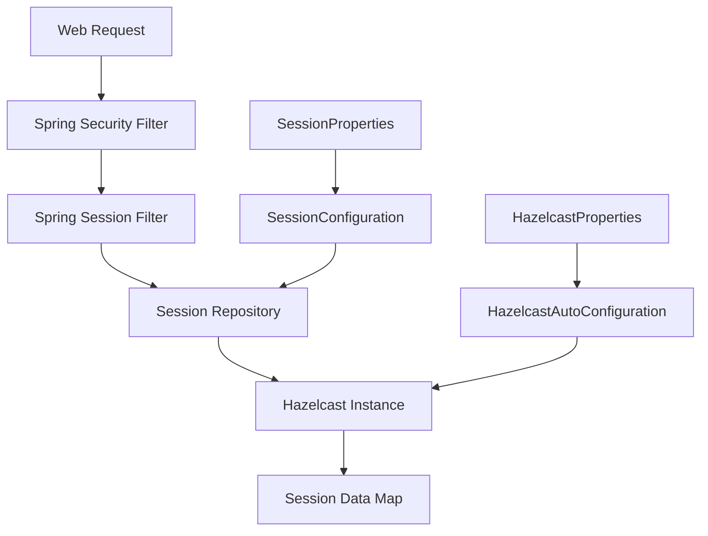

# Design Document

## Overview

This design document outlines the integration of Spring Session with the existing Hazelcast infrastructure in the Camunda BPM Spring Boot application. The solution leverages the existing Hazelcast instance and configuration patterns while adding dedicated session management capabilities. The design ensures seamless integration with Camunda's authentication system and provides distributed session storage for horizontal scaling and session persistence.

## Code Reuse Analysis

### Existing Components to Leverage

- **HazelcastAutoConfiguration**: The existing Hazelcast configuration will be extended to include session-specific map configurations
- **HazelcastProperties**: The existing properties class will be enhanced to include session-related configuration options
- **Application.java**: The existing application startup verification will be extended to include session store validation

### Integration Points

- **Existing Hazelcast Instance**: The Spring Session configuration will reuse the existing HazelcastInstance bean to avoid creating multiple instances
- **Spring Boot Configuration**: Session configuration will follow the existing pattern of externalized configuration via application.yaml
- **Camunda Authentication**: Session management will integrate transparently with Camunda's built-in authentication and user management
- **Actuator Endpoints**: Session metrics will be exposed through the existing management endpoint configuration

## Architecture

The Spring Session integration follows a layered architecture pattern that builds upon the existing Hazelcast infrastructure:

### Modular Design Principles
- **Single File Responsibility**: Session configuration is separated from core Hazelcast configuration in dedicated files
- **Component Isolation**: Session-specific components are isolated but integrate cleanly with existing infrastructure
- **Service Layer Separation**: Session management is handled transparently by Spring Session framework
- **Utility Modularity**: Session-related utilities are separated into focused modules



## Components and Interfaces

### Component 1: SessionProperties
- **Purpose:** Externalized configuration for Spring Session settings
- **Interfaces:** Standard Spring Boot configuration properties pattern
- **Dependencies:** Integrates with existing HazelcastProperties pattern
- **Reuses:** Follows the same configuration pattern as HazelcastProperties.java

### Component 2: SessionConfiguration  
- **Purpose:** Spring Session configuration that integrates with existing Hazelcast instance
- **Interfaces:** Provides SessionRepository bean and session-specific Hazelcast map configuration
- **Dependencies:** HazelcastInstance bean, SessionProperties
- **Reuses:** Existing HazelcastAutoConfiguration pattern and HazelcastInstance bean

## Data Models

Spring Session will use its default data models and serialization mechanisms. No custom session data models will be created - the framework handles all session data serialization and storage internally.

### Session Configuration Model
```yaml
# Extension to existing application.yaml structure
spring:
  session:
    store-type: hazelcast
    hazelcast:
      map-name: "spring-session-sessions"
      flush-mode: on_save
      save-mode: on_set_attribute
    timeout: 30m
    cookie:
      name: "CAMUNDA_SESSION"
      secure: true
      http-only: true
      same-site: lax
```

## Error Handling

### Error Scenarios
1. **Hazelcast Connectivity Loss**
   - **Handling:** Graceful degradation to in-memory sessions with warning logs
   - **User Impact:** Users may need to re-authenticate if server restarts during outage

2. **Session Serialization Failures**
   - **Handling:** Log error and create new session, invalidate problematic session
   - **User Impact:** User is redirected to login page with error message

3. **Session Store Corruption**
   - **Handling:** Log errors and invalidate corrupted sessions
   - **User Impact:** Specific corrupted sessions are invalidated, users may need to re-authenticate

4. **Configuration Errors**
   - **Handling:** Application fails to start with clear error message identifying misconfiguration
   - **User Impact:** System administrator receives clear guidance on fixing configuration

## Testing Strategy

### Unit Testing
- **SessionConfiguration**: Test bean creation and configuration injection
- **SessionProperties**: Test configuration binding and validation

### Integration Testing
- **Session Storage Flow**: Test complete session lifecycle (create, read, update, delete) with Hazelcast
- **Camunda Authentication Integration**: Test that Camunda login creates and manages sessions correctly
- **Multi-Instance Simulation**: Test session sharing between multiple application instances
- **Failover Testing**: Test behavior when Hazelcast becomes temporarily unavailable

### End-to-End Testing
- **User Session Workflow**: Test complete user journey from login through session expiration
- **Application Restart Scenario**: Test that sessions persist across application restarts
- **Load Testing**: Test session performance under concurrent user load
- **Security Testing**: Test session security features (secure cookies, session fixation prevention)

## Configuration Strategy

### Session-Specific Properties Extension
```java
// Extension to existing HazelcastProperties
public static class Session {
    private String mapName = "spring-session-sessions";
    private int maxInactiveIntervalMinutes = 30;
    private String cookieName = "CAMUNDA_SESSION";
    private boolean cookieSecure = true;
    private boolean cookieHttpOnly = true;
    private FlushMode flushMode = FlushMode.ON_SAVE;
    private SaveMode saveMode = SaveMode.ON_SET_ATTRIBUTE;
}
```

### Integration with Existing Configuration
The session configuration will extend the existing `application.yaml` structure:
```yaml
hazelcast:
  enabled: true
  instance-name: camunda-hazelcast
  # Existing configuration...
  session:
    map-name: "spring-session-sessions"
    max-inactive-interval-minutes: 30
    cookie-name: "CAMUNDA_SESSION"
    cookie-secure: true
    cookie-http-only: true
    flush-mode: on_save
    save-mode: on_set_attribute
```

## Security Considerations

### Session Security Features
- **Secure Session IDs**: Spring Session generates cryptographically secure session identifiers
- **Session Fixation Protection**: Built-in protection against session fixation attacks
- **Secure Cookie Configuration**: HTTPOnly and Secure flags enabled by default
- **Session Timeout Management**: Configurable timeout with automatic cleanup

### Data Protection
- **Serialization Security**: Spring Session handles secure serialization of session data
- **Hazelcast Security Integration**: Leverages existing Hazelcast security configuration

## Performance Optimization

### Session Store Performance
- **Connection Pooling**: Reuse existing Hazelcast instance to avoid connection overhead
- **Serialization Efficiency**: Spring Session uses optimized serialization for session data
- **Cache Configuration**: Dedicated session map with optimized settings for session access patterns
- **Memory Management**: Integration with existing Hazelcast memory management and GC optimization

## Deployment Considerations

### Environment Configuration
- **Development**: Shorter session timeout, verbose logging, relaxed cookie security
- **Production**: Secure cookie settings, appropriate timeout values, minimal logging
- **Testing**: Fast session expiration for testing, additional debugging features