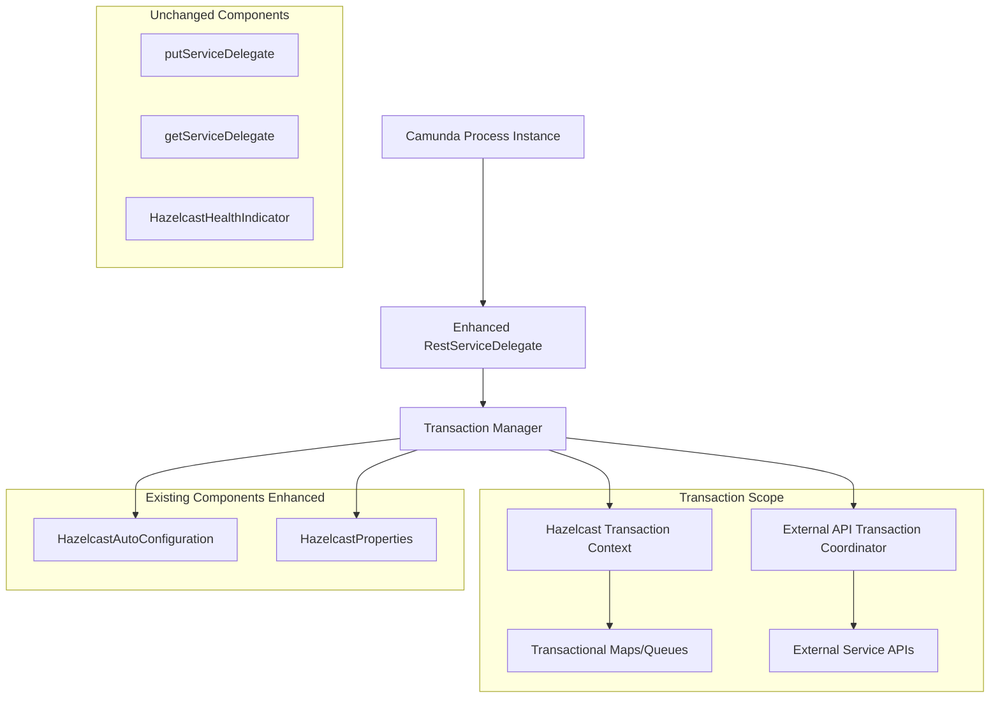

# Design Document

## Overview

The Hazelcast Distributed Transactions feature implements enterprise-grade transactional capabilities that enable multiple Camunda service delegates to safely coordinate operations on shared Hazelcast data structures. This design focuses on extending only the existing RestServiceDelegate to demonstrate and validate Hazelcast's distributed transaction capabilities in a real-world Camunda workflow scenario, ensuring ACID properties across distributed operations.

The architecture introduces a transaction management layer that seamlessly integrates with the existing Camunda workflow engine while providing transactional semantics for Hazelcast operations and external API calls through RestServiceDelegate enhancement only.

## Steering Document Alignment

### Technical Standards (tech.md)

The design follows established technical patterns:
- **Spring Boot 3.4.4 Integration**: Leverages Spring's transaction management patterns with Hazelcast-specific adaptations
- **Camunda BPM 7.23.0 Compatibility**: Maintains compatibility with existing service delegate patterns while adding transaction capabilities to RestServiceDelegate only
- **Hazelcast 5.5.0 Features**: Utilizes native Hazelcast transaction APIs (TransactionContext, TransactionOptions) for optimal performance
- **Java 21 Language Features**: Employs modern Java patterns including records, switch expressions, and enhanced exception handling
- **Configuration-Driven Design**: Extends existing HazelcastProperties with transaction-specific configuration options

### Project Structure (structure.md)

Implementation follows the established modular organization:
- **Transaction Configuration** (`config/` package): Extends existing HazelcastAutoConfiguration with transaction management beans
- **Service Delegates** (`tasks/` package): Enhances only RestServiceDelegate with transactional capabilities
- **Transaction Utilities** (new `transaction/` package): Introduces dedicated transaction management components
- **Test Structure**: Maintains parallel test structure with comprehensive transaction testing scenarios

## Code Reuse Analysis

### Existing Components to Leverage

- **HazelcastAutoConfiguration**: Extended to include transaction manager bean configuration and transactional map setup
- **HazelcastProperties**: Enhanced with new Transaction nested class for configuration management (timeout, type, isolation)
- **RestServiceDelegate**: Primary target for adding distributed transaction capabilities - the only service delegate to be modified
- **Existing Hazelcast Infrastructure**: Leverages current Hazelcast cluster configuration and connectivity without modifications

### Integration Points

- **Camunda Process Engine**: Transaction context propagation through DelegateExecution variables and process instance context
- **Spring Boot Actuator**: Basic health checks integration for transaction monitoring (no changes to existing health indicators)
- **Hazelcast Cluster**: Native transaction coordination using Hazelcast's built-in distributed transaction capabilities
- **External APIs**: XA transaction coordination for external service calls through RestServiceDelegate enhancement
- **Session Management**: Integration with existing Spring Session Hazelcast configuration for consistent transactional behavior

## Architecture

The distributed transaction architecture employs a layered approach with clear separation of concerns, focusing on RestServiceDelegate enhancement:

### Modular Design Principles

- **Single File Responsibility**: Each transaction component handles one specific aspect (manager, coordinator, RestServiceDelegate enhancer, configuration)
- **Component Isolation**: Transaction utilities are independent and mockable for comprehensive testing scenarios
- **Service Layer Separation**: Clear boundaries between transaction management, business logic execution, and data persistence
- **Utility Modularity**: Focused, single-purpose transaction utilities for context management, error handling, and resource cleanup



## Components and Interfaces

### Component 1: HazelcastTransactionManager

- **Purpose:** Central transaction coordination and lifecycle management for distributed operations focused on RestServiceDelegate
- **Interfaces:** 
  - `beginTransaction(TransactionOptions)`: Initiates new distributed transaction with configurable options
  - `commitTransaction(String transactionId)`: Commits all operations atomically across all participants
  - `rollbackTransaction(String transactionId)`: Rolls back all changes and releases resources
  - `getTransactionStatus(String transactionId)`: Returns current transaction state and participant information
- **Dependencies:** HazelcastInstance, TransactionCoordinator, TransactionRegistry
- **Reuses:** Existing HazelcastAutoConfiguration for cluster connectivity and HazelcastProperties for configuration management

### Component 2: TransactionalServiceDelegate

- **Purpose:** Abstract base class providing transactional execution context specifically for RestServiceDelegate enhancement
- **Interfaces:**
  - `executeInTransaction(DelegateExecution, TransactionCallback)`: Wraps business logic in transaction boundary
  - `getTransactionalMap(String mapName)`: Returns TransactionalMap interface for ACID operations
  - `getTransactionalQueue(String queueName)`: Returns TransactionalQueue interface for reliable messaging
  - `handleTransactionFailure(Exception, DelegateExecution)`: Standardized error handling and rollback logic
- **Dependencies:** HazelcastTransactionManager, Camunda DelegateExecution
- **Reuses:** Follows existing service delegate patterns without modifying putServiceDelegate or getServiceDelegate

### Component 3: RestServiceDelegateTransactionEnhancer

- **Purpose:** Extends existing RestServiceDelegate with distributed transaction capabilities for external API coordination
- **Interfaces:**
  - `executeRestCallInTransaction(HttpRequest, TransactionContext)`: Coordinates API calls with Hazelcast operations
  - `handleApiFailure(Exception, TransactionContext)`: Manages rollback and compensation for failed API calls
  - `storeApiResponseTransactionally(Object response, TransactionContext)`: Persists API responses within transaction scope
- **Dependencies:** Enhanced RestServiceDelegate, HttpClient, HazelcastTransactionManager
- **Reuses:** Existing RestServiceDelegate HTTP handling logic with transaction wrapper integration

### Component 4: TransactionConfiguration

- **Purpose:** Spring configuration and bean management for transaction infrastructure
- **Interfaces:**
  - `@Bean transactionManager()`: Creates and configures HazelcastTransactionManager with proper settings
  - `@Bean transactionCoordinator()`: Initializes transaction coordination services with cluster awareness
- **Dependencies:** HazelcastInstance, HazelcastProperties
- **Reuses:** Extends existing HazelcastAutoConfiguration pattern for consistent Spring integration approach

## Data Models

### TransactionContext
```java
public record TransactionContext(
    String transactionId,           // Unique transaction identifier
    String processInstanceId,       // Camunda process instance association
    TransactionType type,           // TWO_PHASE or ONE_PHASE transaction type
    Set<String> participants,       // List of participating operations (focused on RestServiceDelegate)
    Instant startTime,             // Transaction start timestamp
    Duration timeout,              // Configurable transaction timeout
    Map<String, Object> metadata   // Additional context and debugging information
) {}
```

### TransactionResult
```java
public record TransactionResult(
    String transactionId,           // Associated transaction identifier
    TransactionStatus status,       // COMMITTED, ROLLED_BACK, FAILED, TIMEOUT
    Duration executionTime,         // Total transaction execution time
    List<String> operations,        // List of completed operations
    Optional<Exception> failure,    // Failure cause if transaction failed
    Map<String, Object> metrics     // Performance and monitoring metrics
) {}
```

### TransactionOptions
```java
public record TransactionOptions(
    TransactionType type,           // TWO_PHASE (default) or ONE_PHASE for performance
    Duration timeout,              // Default 30 seconds, configurable per transaction
    IsolationLevel isolation,      // REPEATABLE_READ, READ_COMMITTED transaction isolation
    int retryCount,               // Automatic retry attempts for transient failures
    boolean enableXA             // Enable XA coordination with external resources
) {}
```

## Error Handling

### Error Scenarios

1. **Transaction Timeout Scenario**
   - **Handling:** Automatic rollback with resource cleanup, exponential backoff for retry attempts
   - **User Impact:** Clear timeout exception with suggested configuration adjustments and retry guidance

2. **Network Partition During Transaction**
   - **Handling:** Graceful degradation with transaction suspension until connectivity restored, automatic completion or rollback
   - **User Impact:** Transparent recovery with detailed logging for monitoring systems

3. **External API Failure in RestServiceDelegate**
   - **Handling:** Immediate transaction rollback with compensation for completed Hazelcast operations, retry logic for transient failures
   - **User Impact:** Consistent state maintenance with detailed error messages including API response codes and retry suggestions

4. **Hazelcast Cluster Member Failure**
   - **Handling:** Transaction migration to surviving cluster members with automatic failover and state reconstruction
   - **User Impact:** Transparent failover with minimal performance impact and monitoring alerts

5. **Deadlock Detection and Resolution**
   - **Handling:** Automatic deadlock detection with intelligent victim selection, automatic retry with jittered backoff
   - **User Impact:** Automatic resolution with performance metrics and deadlock frequency monitoring

## Testing Strategy

### Unit Testing

- **Transaction Manager Testing**: Mock Hazelcast cluster for isolated transaction lifecycle testing and failure scenario simulation
- **RestServiceDelegate Enhancement Testing**: Comprehensive testing of transactional RestServiceDelegate behavior with various transaction states and failure modes
- **Configuration Testing**: Validation of transaction configuration loading, bean creation, and property binding with different environment settings
- **Error Handling Testing**: Systematic testing of all error scenarios with proper rollback verification and resource cleanup validation

### Integration Testing

- **RestServiceDelegate Transaction Testing**: End-to-end testing of transactions in RestServiceDelegate with real Hazelcast cluster
- **External API Integration Testing**: RestServiceDelegate transaction coordination with mock and real external services, including failure scenarios
- **Cluster Resilience Testing**: Testing transaction behavior during cluster membership changes, network partitions, and node failures
- **Performance Testing**: Load testing with concurrent transactions to validate throughput and latency requirements under stress

### End-to-End Testing

- **Camunda Workflow Integration Testing**: Complete workflow execution with transactional RestServiceDelegate tasks, including happy path and failure scenarios
- **Transaction Recovery Testing**: System restart scenarios with pending transactions, ensuring proper cleanup and recovery behavior
- **Configuration Management Testing**: Testing of different transaction configurations across development, testing, and production environments
- **Compatibility Testing**: Ensuring unchanged putServiceDelegate and getServiceDelegate continue to work alongside enhanced RestServiceDelegate