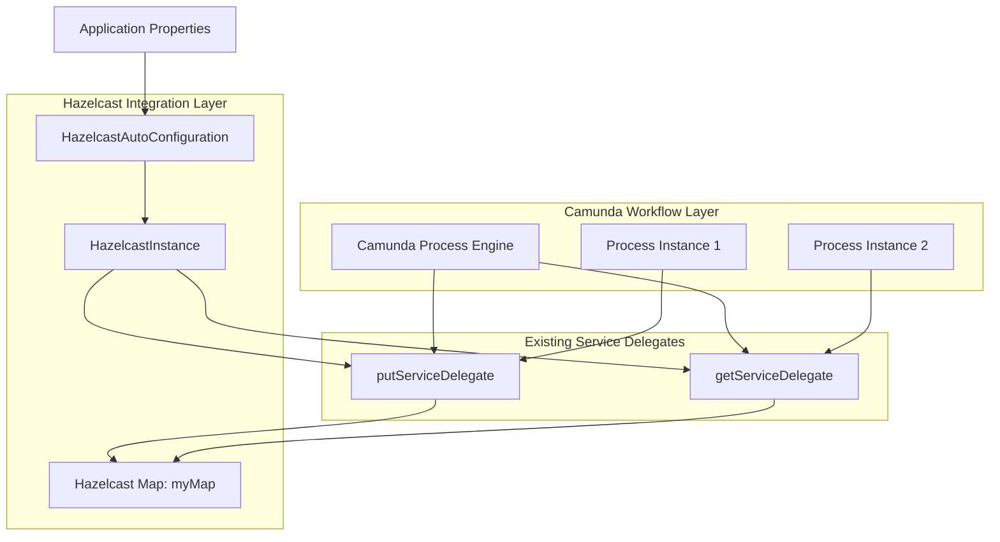

# Design Document

## Overview

The Hazelcast integration will introduce distributed caching capabilities to the existing Camunda BPM Spring Boot application, specifically designed to work with existing Camunda service delegates. This implementation provides an In-Memory Database (IMDB) and In-Memory Data Grid (IMDG) solution that integrates directly with Camunda workflow execution through the existing `putServiceDelegate` and `getServiceDelegate` components.

The design extends the current service delegate pattern to provide distributed caching capabilities across process instances and workflow executions, enabling data sharing between different workflow steps and process instances.

## Steering Document Alignment

### Technical Standards (tech.md)
Since no tech.md exists, this design follows Spring Boot and Camunda BPM best practices:
- Spring Boot auto-configuration patterns
- Camunda service delegate integration patterns
- Property-based configuration
- Dependency injection through Spring's IoC container

### Project Structure (structure.md)
Since no structure.md exists, this design follows the existing project structure:
- Service delegates in `src/main/java/com/example/workflow/tasks/` package
- Configuration classes in appropriate config packages
- Integration with existing Camunda workflow patterns

## Code Reuse Analysis

The current application provides service delegates that are already designed for Hazelcast integration:

### Existing Components to Leverage
- **putServiceDelegate.java**: Existing service delegate for storing data to Hazelcast maps - needs Hazelcast instance injection
- **getServiceDelegate.java**: Existing service delegate for retrieving data from Hazelcast maps - needs Hazelcast instance injection
- **Application.java**: Main Spring Boot application class - will be extended with Hazelcast auto-configuration
- **application.yaml**: Configuration file - will be extended with Hazelcast properties
- **Camunda BPM Framework**: Existing workflow engine - Hazelcast will integrate with process execution context

### Integration Points
- **Service Delegates**: Hazelcast instance will be injected into existing `putServiceDelegate` and `getServiceDelegate`
- **Spring Context**: Hazelcast configuration will be registered as Spring beans for dependency injection
- **Camunda Process Engine**: Hazelcast maps will be accessible throughout workflow execution lifecycle
- **Process Variables**: Hazelcast can complement Camunda's process variable storage for distributed data sharing

## Architecture

The Hazelcast integration follows a service delegate integration pattern that extends existing Camunda workflow capabilities:

### Modular Design Principles
- **Service Delegate Integration**: Hazelcast instance injected into existing service delegates for seamless workflow integration
- **Component Isolation**: Hazelcast configuration isolated from business logic while being accessible to service delegates
- **Workflow Data Sharing**: Enable data sharing between workflow steps and across process instances
- **Configuration Modularity**: Focused configuration classes for Hazelcast setup and map management



## Components and Interfaces

### Component 1: HazelcastAutoConfiguration
- **Purpose:** Provides Spring Boot auto-configuration for Hazelcast instance to be injected into service delegates
- **Interfaces:** 
  - `@Bean HazelcastInstance hazelcastInstance()`
  - `@Bean HazelcastHealthIndicator healthIndicator(HazelcastInstance)`
- **Dependencies:** HazelcastProperties, Spring Boot auto-configuration framework
- **Reuses:** Spring Boot's `@Configuration` and `@ConditionalOnClass` patterns
- **Integration:** Makes HazelcastInstance available for injection into existing service delegates

### Component 2: Enhanced putServiceDelegate
- **Purpose:** Existing service delegate enhanced with proper Hazelcast instance injection for storing workflow data
- **Interfaces:**
  - `void execute(DelegateExecution execution)` - Enhanced to use injected HazelcastInstance
- **Dependencies:** HazelcastInstance (injected), Camunda DelegateExecution
- **Reuses:** Existing service delegate structure and Camunda JavaDelegate pattern
- **Enhancement:** Replace direct hazelcastInstance reference with proper Spring injection

### Component 3: Enhanced getServiceDelegate
- **Purpose:** Existing service delegate enhanced with proper Hazelcast instance injection for retrieving workflow data
- **Interfaces:**
  - `void execute(DelegateExecution execution)` - Enhanced to use injected HazelcastInstance
- **Dependencies:** HazelcastInstance (injected), Camunda DelegateExecution
- **Reuses:** Existing service delegate structure and Camunda JavaDelegate pattern
- **Enhancement:** Replace direct hazelcastInstance reference with proper Spring injection

### Component 4: HazelcastProperties
- **Purpose:** Externalized configuration properties for Hazelcast settings specifically tuned for Camunda integration
- **Interfaces:**
  - String getInstanceName()
  - Map<String, Object> getMapConfigs()
  - ProcessDataConfig getProcessDataConfig()
- **Dependencies:** Spring Boot `@ConfigurationProperties`
- **Reuses:** Spring Boot property binding patterns

### Component 5: HazelcastHealthIndicator
- **Purpose:** Spring Boot Actuator health check for Hazelcast instance status in Camunda context
- **Interfaces:**
  - `Health health()` - Returns UP/DOWN status with workflow-relevant details
- **Dependencies:** HazelcastInstance, Spring Boot Actuator Health framework
- **Reuses:** Spring Boot Actuator's `HealthIndicator` interface

## Data Models

### HazelcastConfiguration Model
```java
@ConfigurationProperties(prefix = "hazelcast")
public class HazelcastProperties {
    private String instanceName = "camunda-hazelcast";
    private boolean embedded = true;
    private ProcessData processData = new ProcessData();
    private Map<String, MapConfig> maps = new HashMap<>();
    
    public static class ProcessData {
        private String defaultMapName = "myMap";
        private int timeToLiveSeconds = 3600;
        private int maxIdleSeconds = 1800;
        private int maxSize = 10000;
        private String evictionPolicy = "LRU";
    }
    
    public static class MapConfig {
        private int timeToLiveSeconds = 3600;
        private int maxIdleSeconds = 1800;
        private int maxSize = 10000;
        private String evictionPolicy = "LRU";
    }
}
```

### Process Data Entry Model
```java
public class ProcessDataEntry {
    private String processInstanceId;
    private String activityId;
    private Object value;
    private long timestamp;
    private String dataType;
    
    // Constructors and methods for process-specific data handling
}
```

### Service Delegate Integration Model
```java
// Enhanced putServiceDelegate structure
@Component("putServiceDelegate")
public class putServiceDelegate implements JavaDelegate {
    
    @Autowired
    private HazelcastInstance hazelcastInstance;
    
    @Override
    public void execute(DelegateExecution execution) throws Exception {
        String activityId = execution.getCurrentActivityId();
        String processInstanceId = execution.getProcessInstanceId();
        
        IMap<String, Object> map = hazelcastInstance.getMap("myMap");
        map.put(generateKey(processInstanceId, activityId), "value");
    }
}
```

## Error Handling

### Error Scenarios
1. **Hazelcast Instance Injection Failure**
   - **Handling:** Service delegates gracefully handle null Hazelcast instance, log warning, continue workflow execution
   - **User Impact:** Workflow continues without distributed caching, process execution not interrupted

2. **Map Operation Failures in Service Delegates**
   - **Handling:** Catch HazelcastException in service delegates, log with process context, continue workflow
   - **User Impact:** Individual workflow step continues, data not cached but process execution proceeds

3. **Process Data Inconsistency**
   - **Handling:** Implement process-aware key generation and data validation in service delegates
   - **User Impact:** Consistent data access patterns across workflow instances

4. **Service Delegate Configuration Issues**
   - **Handling:** Validate Hazelcast availability during service delegate execution, provide fallback behavior
   - **User Impact:** Clear error messages in workflow context, process execution continues with reduced functionality

5. **Workflow Data Access Conflicts**
   - **Handling:** Implement proper locking and conflict resolution for concurrent process access
   - **User Impact:** Data integrity maintained across concurrent workflow executions

## Testing Strategy

### Unit Testing
- **Enhanced Service Delegate Tests**: Test putServiceDelegate and getServiceDelegate with mocked HazelcastInstance
- **HazelcastAutoConfiguration Tests**: Verify bean creation and injection into service delegates
- **Process Data Handling Tests**: Test data storage and retrieval patterns specific to workflow execution
- **Error Handling Tests**: Verify service delegate behavior when Hazelcast operations fail
- **Key Generation Tests**: Test process-aware key generation for data isolation

### Integration Testing
- **Camunda-Hazelcast Integration Tests**: Test full workflow execution with Hazelcast data sharing
- **Service Delegate Integration**: Test data flow between putServiceDelegate and getServiceDelegate in workflow context
- **Process Instance Isolation**: Verify data isolation and sharing patterns across process instances
- **Configuration Integration**: Test various Hazelcast configurations with Camunda service delegates
- **Health Check Integration**: Verify actuator endpoint reports correct status in workflow context

### End-to-End Testing
- **Workflow Data Persistence Tests**: Test data persistence across workflow steps using service delegates
- **Multi-Instance Process Tests**: Test data sharing between multiple process instances
- **Process Variable Integration**: Test interaction between Hazelcast data and Camunda process variables
- **Error Recovery in Workflows**: Test workflow behavior during Hazelcast failures and recovery
- **Performance with Workflow Load**: Test Hazelcast performance under typical workflow execution patterns